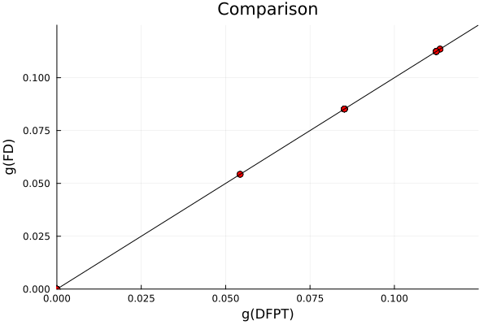
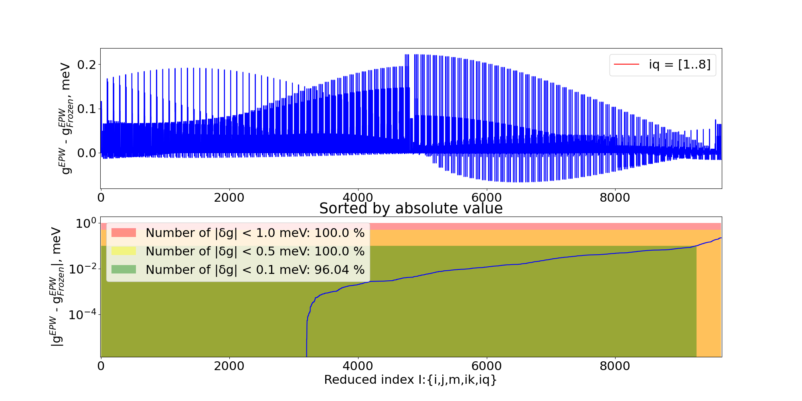
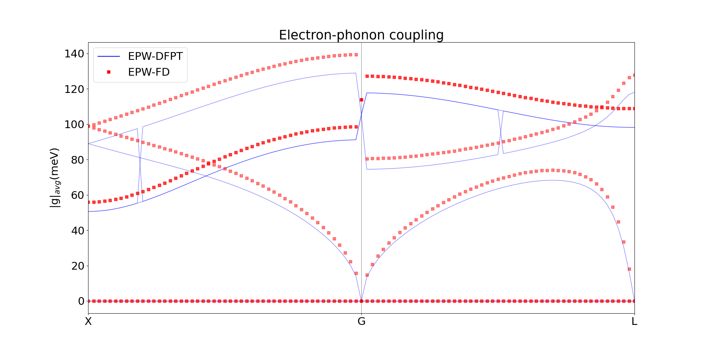

# Examples

This example demonstrates the calculation of electron-phonon matrix elements for Silicon on a $\mathbf{k}=\mathbf{q}=2\times2\times2$ grid using the projectability approach with PBE and HSE functionals.  

## Silicon with PBE

The first step is loading the ElePhAny module together with PythonCall, as we are using the ASE and Phonopy libraries to handle the creation of Quantum Espresso inputs and phonon calculations, respectively.

```julia
 using ElectronPhonon, PythonCall
```
Then, we need to decide where to create the folder with the corresponding data for the finite difference (FD) calculation. Consider that we set `path_to_calc` to the same path where the `si.jl` script for the calculation is located. We expect the following structure of the calculation:

```julia
path_to_calc = pwd() * "/"
```

```md
.
├── si.jl
├── run.sh
└── displacements
    ├── dyn_mat
    ├── epw
    ├── group_1
    ...
    ├── group_12
    ├── out
    ├── phonopy_params.yaml
    ├── phonopy.yaml
    ├── qpoints.yaml
    ├── scf_0
    └── sc_size.conf
```

Let's break it down piece by piece. Inside `displacement` folder, there are `group_*` folders that contain input/output of the displaced configurations (`scf.in scf.out nscf.in nscf.out`) that we need for further post-processing. 
`scf_0` folders contain information about pristine calculation together with `*jld2` files that are needed for restarting of the code once the post-processing is partially finished. `phonopy_params.yaml` and `phonopy.yaml qpoints.yaml sc_size.conf` contains information related to Phonopy calculation. 
`out` folder contains information about electron-phonon elements calculated with DFPT and FD on the coarse-grid for a given `ik` and `iq` point per file. `epw` and `dyn_mat` folders are needed for further interface with EPW package. 
If run.sh is also present in the root folder, then subsequent executions of QE are going to be done using Slurm, and `run.sh` is going to be copied in all the `group_*` and `scf_0` folders. 

Now we need to set up additional settings for the FD calculation: `abs_disp` is the size of the finite displacement which we are going to apply to atoms (Bohr). `path_to_qe` is an optional path to the Quantum Espresso (QE) source folder, needed only when we want to compare results of FD with DFPT; otherwise, ElePhAny assumes that QE executables are on the path. To access electron-phonon elements, you will need to compile a special version of the ph.x code located in `testsuite/non_epw_comp` of QE.
The following parameter, `mpi_ranks`, is required for the parallel execution of QE. It is ignored if `run.sh` is present and calculations are run using Slurm.
The `use_symm` flag corresponds to whether symmetries of displaced configurations are going to be used or every atom of the unit cell is going to be perturbed.
At last, `sc_size` corresponds to the supercell size, which corresponds to the $\mathbf{q}$ grid.
`k_mesh` corresponds to the k-points sampling of the *supercells*. To have consistency between pristine unit cells and displaced supercells, k-point sampling of the pristine unit cell is a product of $sc\_size \times k\_mesh$.
 
```julia
#Params
abs_disp = 1e-3
path_to_qe= "/home/poliukhin/Soft/sourse/q-e/"
mpi_ranks = 8
use_symm = false
sc_size::Vec3{Int} = [2,2,2]
k_mesh::Vec3{Int}  = [1,1,1]
```

The final step in setting up the calculation is to create the QE input file for the pristine system. It is handled by ASE and Phonopy packages, for which we need to provide `unitcell` and `scf_parameters` python-like dictionaries. 

```julia
# Lattice constant of Silicon
a = 5.43052   in Angstrom

unitcell = Dict(
    :symbols =>  pylist(["Si", "Si"]),
    :cell => pylist([[-0.5 * a, 0.0, 0.5 * a],
    [0.0, 0.5 * a, 0.5 * a],
    [-0.5 * a, 0.5 * a, 0.0]]),
    :scaled_positions => pylist([(0, 0, 0), (0.75, 0.75, 0.75)]),
    :masses => pylist([28.08550, 28.08550])
)

# Set up the calculation parameters as a Python dictionary
scf_parameters = Dict(
    :format => "espresso-in",
    :kpts => pytuple((k_mesh[1]*sc_size[1], k_mesh[2]*sc_size[2], k_mesh[3]*sc_size[3])),
    :calculation =>"scf",
    :prefix => "scf",
    :outdir => "./tmp/",
    :pseudo_dir => "/home/poliukhin/Development/frozen_phonons/elph/example/pseudo",
    :ecutwfc => 60,
    :conv_thr =>1.e-13,
    :pseudopotentials => Dict("Si" => "Si.upf"),
    :diagonalization => "ppcg",#david
    :mixing_mode => "plain",
    :mixing_beta => 0.7,
    :crystal_coordinates => true,
    :verbosity => "high",
    :tstress => false,
    :ibrav => 2,
    :tprnfor => true,
    :nbnd => 4,
    :electron_maxstep => 1000
)
```

Once all the settings are set, we can create the model. If use_symm is set to `true`, the code will analyze and find the minimum amount of displacements that is consistent with Phonopy.

```julia
model = create_model(path_to_calc = path_to_calc,
                      abs_disp = abs_disp,
                      path_to_qe = path_to_qe,
                      mpi_ranks = mpi_ranks,
                      sc_size = sc_size,
                      k_mesh  = k_mesh,
                      unitcell = unitcell,
                      scf_parameters = scf_parameters,
                      use_symm = use_symm);
```

## Running code 

Once all the preparation is complete, all subsequent functions will operate directly with the model object. First, we could create the displaced configurations and run related DFT calculations.

```julia 
create_disp_calc!(model; from_scratch = from_scratch)
run_calculations(model)
```

!!! note
    If the calculations are run on the cluster and run.sh is present in the root directory, the calculations must be run sequentially, as `run_calculations(model)` is designed to execute both SCF and NSCF calculations. In this case, use the following functions, running them one by one (scf pristine and displaced, nscf pristine, nscf displaced):

    ```julia 
    create_disp_calc!(model; from_scratch = from_scratch)
    run_disp_calc(model)
    run_nscf_calc(model)
    run_disp_nscf_calc(model)
    ```     

Once all the calculations are done, we could post-process the results. The `prepare_model` function will unfold pristine wave functions to the supercell and save them in the binary '*jld2' format for further post-processing. It will also call Phonopy to create a diagonal force constant matrix to access phonon data. After this, the `create_electrons` and `create_phonons` functions will create and save data for the final electron-phonon matrix element calculations. To save space and computational time `create_electrons` will save braket matixes beetween displaced and undisplaced wave-functions $U^{\pm}_{jn\mathbf{k}} = \langle \psi^{\pm}_{j} \mid \psi_{n\mathbf{k}} \rangle$ instead of wave functions itself.

```julia 
prepare_model(model)
electrons = create_electrons(model)
phonons = create_phonons(model)
```
!!! note
    If the electrons and phonons objects were already created before, we could take advantage of the loading functions and not recalculate $U^{\pm}_{jn\mathbf{k}}$ matrices.
    ```julia 
    electrons = load_electrons(model)
    phonons = load_phonons(model)
    ``` 

!!! tip
    Since part of this code allows manipulating wave functions that QE saves in binary or HDF5 format, it is helpful to present some examples. Considering that we have QE calculation with `tmp/scf.save/` folder, which contains several wave functions `wfc*.dat` or `wfc*.hdf5`, we could read them directly in Julia.

    ```julia 
    miller, psi_list = parse_wf("./tmp/scf.save/wfc1")
    ```

    QE saves wave function in reciprocal space $\psi_{n\mathbf{k}}(\mathbf{r}) = \sum_{G}\psi_{n\mathbf{k}}(\mathbf{G}) e^{i(\mathbf{G} +\mathbf{k})\mathbf{r}}$, where `psi_list` is a list of wave functions coefficient for every band with $N_{\mathbf{G}}$ coefficients per band that coresponds to $\psi_{n\mathbf{k}}(\mathbf{G})$.
    `miller` is matrix $3 \times N_{\mathbf{G}}$ that allows to resonstruct the $\mathbf{G}$ vector of coresponding plane wave coefficient $\psi_{n\mathbf{k}}(\mathbf{G})$ by using (read more about wave functions in QE on [Gitlab Wiki page](https://gitlab.com/QEF/q-e/-/wikis/Developers/Format-of-data-files)):
        
    $$\mathbf{G}[i, j, k] = \text{miller}[1,i] \mathbf{b}_1 + \text{miller}[2,i] \mathbf{b}_2 + \text{miller}[3,i] \mathbf{b}_3$$

    Having access to wave function coefficients and Miller indices, we could easily transform the wave function to real or reciprocal space as well as calculate brackets between them.

    ```julia 
    N_fft = determine_fft_grid("./tmp/scf.save/data-file-schema.xml"; use_xml=true)
    psi_list_R = [wf_from_G(miller, psi_G, N_fft) for psi_G in psi_list]
    psi_list_G = [wf_to_G(miller, psi_R, N_fft) for psi_R in psi_list_R]
    braket_G = calculate_braket(psi_list_G[1],psi_list_G[2])
    braket_R = calculate_braket_real(psi_list_R[2], psi_list_R[2])
    ```

Now, the final part of the calculation is the construction of the electron-phonon matrix for every k and q points of interest. 
`electron_phonon_qe` function will try to calculate electron-phonon matrix elements directly in QE so that comparison between DFPT and FD could be made (provided a special version of ph.x is compiled). `plot_ep_coupling` allows simple visualization of the output quantities. 

```julia 
# Electron-phonon matrix elements
ik_list = [i for i in 1:prod(k_mesh*sc_size)]
iq_list = [i for i in 1:prod(k_mesh*sc_size)]

for ik in ik_list
    for iq in iq_list
        electron_phonon_qe(model, ik, iq)# requires to compile special ph.x in testsuite/non_epw_comp
        electron_phonon(model, ik, iq, electrons, phonons;) #save_epw = true
        plot_ep_coupling(model, ik, iq)
    end
end
```

Inspecting the `out` folder, we could find the resulting comparison of electron-phonon matrix elements. For example for `ik` = 2, `iq` = 1, we see that FD and DFPT mathes perfectly 😎:



## Interface with EPW

!!! warn
    This section provides an interface to the EPW software. Since the usage of it is not very smooth and EPW developers are moving to storing data in HDF5 files, stay tuned for an improved version of the interface that does not require an explicit call to the Python script. 

To run this section of the example we need to run part of the script that constructs electron-phonon matrix element, this time without explicit comparison with DFPT and adding aditional flag that saves data readable by EPW:

```julia
electron_phonon(model, ik, iq, electrons, phonons; save_epw = true)
```

Having access to the electron-phonon matrix elements on the coarse grid, it is easy to build an interface with the relevant code that could obtain electron-phonon related properties. We are going with EPW code for this matter since it has a straightforward interface to the QE package. Continuing the example where we created `displacements` folder in the same place where we have the execution script, we will add a few additional files in the root folder.

```sh
touch ph.in
touch epw0.in
touch epw1.in
touch epw2.in
touch path_k.kpt
touch path_q.kpt
touch run.sh
```

```ini
!ph.in
&inputph
  recover=.false.
  tr2_ph=1.0d-17,
  prefix='si',
  amass(1)=28.0855,
  outdir='./',
  fildyn='si.dyn.xml',
  fildvscf='dvscf'
  ldisp=.true.,
  nq1 = 2,
  nq2 = 2,
  nq3 = 2
 /
```

```ini
!epw0.in
&inputepw
    prefix      = 'si'
    amass(1)    = 28.0855,
    outdir      = './'
    dvscf_dir   = './save/'
    elph        = .true.
    epbwrite    = .true.
    epbread     = .false.
    epwwrite    = .true.
    epwread     = .false.
    use_ws      = .true.
    nbndsub     =  4
    wannierize   = .true.
    num_iter     = 50000
    iprint       = 2
    proj(1)     = 'f=0,0,0:sp3'

    nkf1 = 1
    nkf2 = 1
    nkf3 = 1
    nqf1 = 1
    nqf2 = 1
    nqf3 = 1
    nk1  = 2
    nk2  = 2
    nk3  = 2
    nq1  = 2
    nq2  = 2
    nq3  = 2
 /
```
 
```ini
!epw1.in
--
&inputepw
  prefix      = 'si'
  amass(1)    = 28.0855,
  outdir      = './'
  dvscf_dir   = './save/'
  elph        = .true.
  epbwrite    = .false.
  epbread     = .true.
  epwwrite    = .true.
  epwread     = .false.
  use_ws      = .true.
  nbndsub        =  4
  wannierize     = .false.
  num_iter       = 50000
  iprint         = 2
  proj(1)        = 'f=0,0,0:sp3'
  prtgkk = .true.
  band_plot = .false.
  
  filkf = 'path_k.kpt'
  filqf = 'path_q.kpt'
  nk1  = 2
  nk2  = 2
  nk3  = 2
  nq1  = 2
  nq2  = 2
  nq3  = 2
 /
```

```ini
!epw2.in
&inputepw
  prefix      = 'si'
  amass(1)    = 28.0855,
  outdir      = './'
  dvscf_dir   = './save/'
  elph        = .true.
  epbwrite    = .false.
  epbread     = .true.
  epwwrite    = .true.
  epwread     = .false.
  use_ws      = .true.
  nbndsub        =  4
  wannierize     = .true.
  num_iter       = 50000
  iprint         = 2
  proj(1)        = 'f=0,0,0:sp3'
  prtgkk = .true.
  band_plot = .false.
  
  filkf = 'path_k.kpt'
  filqf = 'path_q.kpt'
  nk1  = 2
  nk2  = 2
  nk3  = 2
  nq1  = 2
  nq2  = 2
  nq3  = 2
 /
```

```ini
!path_k.kpt
1 cartesian
 0.0000000000      0.0000000000     0.0000000000  1.0
```

```ini
!path_q.kpt
101 cartesian
    1.0000000000  0.000000000  0.000000000  1.0
    0.9800000000  0.000000000  0.000000000  1.0
    0.9600000000  0.000000000  0.000000000  1.0
    0.9400000000  0.000000000  0.000000000  1.0
    0.9200000000  0.000000000  0.000000000  1.0
    0.9000000000  0.000000000  0.000000000  1.0
    0.8800000000  0.000000000  0.000000000  1.0
    0.8600000000  0.000000000  0.000000000  1.0
    0.8400000000  0.000000000  0.000000000  1.0
    0.8200000000  0.000000000  0.000000000  1.0
    0.8000000000  0.000000000  0.000000000  1.0
    0.7800000000  0.000000000  0.000000000  1.0
    0.7600000000  0.000000000  0.000000000  1.0
    0.7400000000  0.000000000  0.000000000  1.0
    0.7200000000  0.000000000  0.000000000  1.0
    0.7000000000  0.000000000  0.000000000  1.0
    0.6800000000  0.000000000  0.000000000  1.0
    0.6600000000  0.000000000  0.000000000  1.0
    0.6400000000  0.000000000  0.000000000  1.0
    0.6200000000  0.000000000  0.000000000  1.0
    0.6000000000  0.000000000  0.000000000  1.0
    0.5800000000  0.000000000  0.000000000  1.0
    0.5600000000  0.000000000  0.000000000  1.0
    0.5400000000  0.000000000  0.000000000  1.0
    0.5200000000  0.000000000  0.000000000  1.0
    0.5000000000  0.000000000  0.000000000  1.0
    0.4800000000  0.000000000  0.000000000  1.0
    0.4600000000  0.000000000  0.000000000  1.0
    0.4400000000  0.000000000  0.000000000  1.0
    0.4200000000  0.000000000  0.000000000  1.0
    0.4000000000  0.000000000  0.000000000  1.0
    0.3800000000  0.000000000  0.000000000  1.0
    0.3600000000  0.000000000  0.000000000  1.0
    0.3400000000  0.000000000  0.000000000  1.0
    0.3200000000  0.000000000  0.000000000  1.0
    0.3000000000  0.000000000  0.000000000  1.0
    0.2800000000  0.000000000  0.000000000  1.0
    0.2600000000  0.000000000  0.000000000  1.0
    0.2400000000  0.000000000  0.000000000  1.0
    0.2200000000  0.000000000  0.000000000  1.0
    0.2000000000  0.000000000  0.000000000  1.0
    0.1800000000  0.000000000  0.000000000  1.0
    0.1600000000  0.000000000  0.000000000  1.0
    0.1400000000  0.000000000  0.000000000  1.0
    0.1200000000  0.000000000  0.000000000  1.0
    0.1000000000  0.000000000  0.000000000  1.0
    0.0800000000  0.000000000  0.000000000  1.0
    0.0600000000  0.000000000  0.000000000  1.0
    0.0400000000  0.000000000  0.000000000  1.0
    0.0200000000  0.000000000  0.000000000  1.0
    0.0000000000  0.000000000  0.000000000  1.0
   -0.0100000000      0.0100000000      0.0100000000  1.0
   -0.0200000000      0.0200000000      0.0200000000  1.0
   -0.0300000000      0.0300000000      0.0300000000  1.0
   -0.0400000000      0.0400000000      0.0400000000  1.0
   -0.0500000000      0.0500000000      0.0500000000  1.0
   -0.0600000000      0.0600000000      0.0600000000  1.0
   -0.0700000000      0.0700000000      0.0700000000  1.0
   -0.0800000000      0.0800000000      0.0800000000  1.0
   -0.0900000000      0.0900000000      0.0900000000  1.0
   -0.1000000000      0.1000000000      0.1000000000  1.0
   -0.1100000000      0.1100000000      0.1100000000  1.0
   -0.1200000000      0.1200000000      0.1200000000  1.0
   -0.1300000000      0.1300000000      0.1300000000  1.0
   -0.1400000000      0.1400000000      0.1400000000  1.0
   -0.1500000000      0.1500000000      0.1500000000  1.0
   -0.1600000000      0.1600000000      0.1600000000  1.0
   -0.1700000000      0.1700000000      0.1700000000  1.0
   -0.1800000000      0.1800000000      0.1800000000  1.0
   -0.1900000000      0.1900000000      0.1900000000  1.0
   -0.2000000000      0.2000000000      0.2000000000  1.0
   -0.2100000000      0.2100000000      0.2100000000  1.0
   -0.2200000000      0.2200000000      0.2200000000  1.0
   -0.2300000000      0.2300000000      0.2300000000  1.0
   -0.2400000000      0.2400000000      0.2400000000  1.0
   -0.2500000000      0.2500000000      0.2500000000  1.0
   -0.2600000000      0.2600000000      0.2600000000  1.0
   -0.2700000000      0.2700000000      0.2700000000  1.0
   -0.2800000000      0.2800000000      0.2800000000  1.0
   -0.2900000000      0.2900000000      0.2900000000  1.0
   -0.3000000000      0.3000000000      0.3000000000  1.0
   -0.3100000000      0.3100000000      0.3100000000  1.0
   -0.3200000000      0.3200000000      0.3200000000  1.0
   -0.3300000000      0.3300000000      0.3300000000  1.0
   -0.3400000000      0.3400000000      0.3400000000  1.0
   -0.3500000000      0.3500000000      0.3500000000  1.0
   -0.3600000000      0.3600000000      0.3600000000  1.0
   -0.3700000000      0.3700000000      0.3700000000  1.0
   -0.3800000000      0.3800000000      0.3800000000  1.0
   -0.3900000000      0.3900000000      0.3900000000  1.0
   -0.4000000000      0.4000000000      0.4000000000  1.0
   -0.4100000000      0.4100000000      0.4100000000  1.0
   -0.4200000000      0.4200000000      0.4200000000  1.0
   -0.4300000000      0.4300000000      0.4300000000  1.0
   -0.4400000000      0.4400000000      0.4400000000  1.0
   -0.4500000000      0.4500000000      0.4500000000  1.0
   -0.4600000000      0.4600000000      0.4600000000  1.0
   -0.4700000000      0.4700000000      0.4700000000  1.0
   -0.4800000000      0.4800000000      0.4800000000  1.0
   -0.4900000000      0.4900000000      0.4900000000  1.0
   -0.5000000000      0.5000000000      0.5000000000  1.0    
```


```ini
#run.sh
#!/bin/bash

export QE_PATH="/home/poliukhin/Soft/sourse/q-e/bin/"
export NMPI=8
export NPOOL=8
export PARA_PREFIX="mpirun"
export ELEPHANY_PATH="/home/poliukhin/Development/ElectronPhonon/"

copy data ....
cp -r ./displacements/scf_0/tmp/scf.save ./si.save
cp -r ./displacements/scf_0/scf.out ./
echo "0, copy finished finished"

$PARA_PREFIX -n $NMPI $QE_PATH/pw.x -npool $NPOOL -in nscf.in > nscf.out
echo "2, nscf finished"   

$PARA_PREFIX -n $NMPI $QE_PATH/ph.x -npool $NPOOL -in ph.in > ph.out
echo "1, ph finished"

python3 /home/poliukhin/Soft/q-e/EPW/bin/pp.py << EOF
si
EOF
echo "2, pp.py finished"

epw.x -in epw0.in  > epw0.out
echo "3, epw0 finished"

$QE_PATH/epw.x -in epw1.in  > epw1.out
echo "4, epw1 finished"

cp -r si.save/ si_dft.save/ 
cp si.epb1 si_dft.save/

python $ELEPHANY_PATH/epw/parse_epb.py
python $ELEPHANY_PATH/epw/fake2nscf.py

$QE_PATH/epw.x < epw2.in  > epw2.out
echo "4, epw2 finished"
```

For the additional explanation of different options of EPW, consult the [documentation](https://docs.epw-code.org/doc/Inputs.html). For the `scf` and `nscf` calculations, we are reusing data from the `displacements/scf_0` folder. After copying the ground state calculation, we are performing phonon calculations using the `ph.in` input file. After converting data to the EPW readable format using the `pp.py` script, we run `epw0.in`, which creates a `si.epb` file containing all the essential data related to the electron-phonon calculation. This is the file that we will modify using the `parse_epb.py` script. The script allows parsing of a Fortran binary file and modifying related electron eigenvalues, phonon dynamical matrices, and electron-phonon matrix elements in the Kohn-Sham basis (without multiplying by the phonon eigenvector). The important caveat here is that the electron-phonon matrix is not gauge invariant, which means that we have to carry initial wave functions that were used to create the matrix to be consistent with Wannier interpolation. For this, the second script `fake2nscf.py` is used to copy wavefunctions and eigenvalues that were obtained with any functional to the format QE could read. These scripts are the temporary solutions to the interface and are located in the `epw` folder of the source code. 

After successfully parsing the electron-phonon matrix and modifying the wavefunction, we can rerun EPW using `epw2.in`, which will read the modified EPW files, perform wannierization, and then calculate interpolated quantities. To compare the results between DFPT and FD, we could use `compare_epw.py`.


```sh
python $ELEPHANY_PATH/epw/compare_epw.py
```



## Silicon with Hybrids

Since the proposed approach can be straightforwardly applied to any functional of interest, we could perform the same calculation, for example, for the Hybrid functional. In QE, we could do it by just adding a few additional parameters and following the rest of the example. 

```julia 
scf_parameters_hse = Dict(
 :input_dft => "HSE",
 :nqx1 => 1,
 :nqx2 => 1,
 :nqx3 => 1
)

merge!(scf_parameters, scf_parameters_hse)
```
In case any other method beyond DFT is of interest, one could intervene after the electrons and phonons object is created and change the corresponding eigenvalues and eigenvectors. By following the same calculation as the previous step, we can gain access to the electron-phonon coupling with the HSE functional.  To plot electron-phonon coupling along the path specified in `path_k.kpt` and `path_q.kpt` files, use the `plot_epw.py` script.

```sh
python $ELEPHANY_PATH/epw/plot_epw.py
```



On this plot, FD is obtained with the HSE functional, which is inaccessible to standard DFPT 💥 . As we can see, more complex functionals tend to increase the coupling, which, in the case of e.g., transport, would lower the carried drift mobility. See more [arXiv prepaper]() for more details on this.